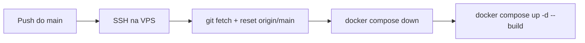

# 🧵 Mercha — Platforma E-commerce

[](https://python.org)
[](https://fastapi.tiangolo.com)
[](https://react.dev)
[](https://typescriptlang.org)
[](https://postgresql.org)
[](https://docker.com)
[](https://tailwindcss.com)
[](https://mui.com)
[](https://github.com/features/actions)
[](https://cloudinary.com)

---

Nowoczesna platforma e-commerce zbudowana w architekturze **React + FastAPI + PostgreSQL**. Obejmuje w pełni funkcjonalny sklep internetowy dla klientów oraz rozbudowany panel administracyjny do zarządzania produktami, zamówieniami i stanami magazynowymi.

---

## 📋 Spis treści

- [Stack technologiczny](#-stack-technologiczny)
- [Architektura](#-architektura)
- [Struktura projektu](#-struktura-projektu)
- [Funkcjonalności](#-funkcjonalności)
- [Model danych](#-model-danych)
- [Uruchomienie lokalne](#-uruchomienie-lokalne)
- [Uruchomienie przez Docker Compose](#-uruchomienie-przez-docker-compose)
- [Konfiguracja środowiska](#-konfiguracja-środowiska)
- [API Endpoints](#-api-endpoints)
- [Autoryzacja](#-autoryzacja)
- [Testy](#-testy)
- [CI/CD](#-cicd)
- [Wdrożenie na VPS](#-wdrożenie-na-vps)
- [Skrypty pomocnicze](#-skrypty-pomocnicze)
- [Plan rozwoju](#-plan-rozwoju)

---

## 🧱 Stack technologiczny

| Warstwa | Technologia | Wersja |
|---------|-------------|--------|
| **Backend API** | FastAPI + SQLAlchemy 2.0 (async) | Python 3.12+ |
| **Baza danych** | PostgreSQL 16 (przez asyncpg) | 16 |
| **Shop (frontend)** | Vite + React 18 + Tailwind CSS 3 + React Router v6 | Node 18+ |
| **Admin (frontend)** | Vite + React 18 + Material UI 5 + React Router v6 | Node 18+ |
| **Autoryzacja** | JWT (python-jose) + bcrypt (passlib) | — |
| **Migracje** | Alembic | — |
| **Upload zdjęć** | Cloudinary | — |
| **Konteneryzacja** | Docker Compose | — |
| **Reverse proxy** | nginx | — |
| **CI/CD** | GitHub Actions | — |
| **Wdrożenie** | SSH + Docker Compose na VPS | — |

---

## 🏗️ Architektura

```
┌─────────────────────────────────────────────────────┐
│                    nginx (reverse proxy)              │
│  dev: localhost:80   prod: stitchcore.pl :443        │
└──────┬──────────────────────┬──────────────────┬─────┘
       │                      │                  │
       ▼                      ▼                  ▼
┌──────────────┐    ┌──────────────┐    ┌──────────────┐
│   frontend-  │    │   frontend-  │    │   Backend    │
│   shop       │    │   admin      │    │   FastAPI    │
│  :5173       │    │  :5174       │    │  :8000       │
│  React       │    │  MUI         │    │  async       │
│  Tailwind    │    │  Admin panel │    │  SQLAlchemy  │
└──────────────┘    └──────────────┘    └──────┬───────┘
                                                │
                                                ▼
                                        ┌──────────────┐
                                        │  PostgreSQL  │
                                        │    16        │
                                        │  :5432       │
                                        └──────────────┘
```

Backend działa w architekturze warstwowej:

```
Route (FastAPI) → Service (logika biznesowa) → Model (SQLAlchemy ORM) → DB
```

---

## 📁 Struktura projektu

```
mercha/
│
├── backend/                        # 🖥️ Backend API (FastAPI + PostgreSQL)
│   ├── app/
│   │   ├── main.py                 # Entry point — FastAPI z lifespan (migracje + init admina)
│   │   ├── api/v1/                 # Endpoints REST
│   │   │   ├── router.py           # Agregacja routerów pod /api/v1
│   │   │   ├── auth.py             # POST register, login, refresh, GET me
│   │   │   ├── products.py         # CRUD kategorii, produktów, wariantów, zdjęć
│   │   │   ├── orders.py           # CRUD zamówień, zmiana statusu
│   │   │   └── inventory.py        # Stany magazynowe, lokalizacje, ruchy
│   │   ├── core/                   # Konfiguracja
│   │   │   ├── config.py           # Pydantic Settings — zmienne z .env
│   │   │   ├── database.py         # Engine + async session + Base ORM
│   │   │   ├── security.py         # Hashowanie haseł (bcrypt), JWT (python-jose)
│   │   │   └── deps.py             # Zależności: get_current_user, get_current_admin
│   │   ├── models/                 # Modele SQLAlchemy
│   │   │   ├── user.py             # User, RefreshToken
│   │   │   ├── product.py          # Category, Product, ProductVariant, ProductImage
│   │   │   ├── order.py            # Order, OrderItem
│   │   │   └── inventory.py        # WarehouseLocation, Inventory, StockMovement
│   │   ├── schemas/                # Schematy Pydantic (walidacja + serializacja)
│   │   │   └── __init__.py         # Wszystkie schematy w jednym pliku
│   │   ├── services/               # Logika biznesowa
│   │   │   ├── auth.py             # Rejestracja, logowanie, tokeny
│   │   │   ├── product.py          # CRUD produktów, kategorii, wariantów
│   │   │   ├── order.py            # Tworzenie zamówień, rezerwacja stanów
│   │   │   ├── inventory.py        # Stany, korekty, ruchy magazynowe
│   │   │   └── upload.py           # Upload zdjęć do Cloudinary (5MB, JPEG/PNG/WEBP)
│   │   └── scripts/                # Skrypty uruchamiane przy starcie / ręcznie
│   │       ├── init_admin.py       # Auto-tworzenie admina (admin@mercha.pl)
│   │       └── seed_data.py        # Zasiewanie przykładowych danych
│   ├── alembic/                    # Migracje bazy danych
│   │   └── versions/               # Kolejne migracje
│   ├── alembic.ini
│   ├── Dockerfile                  # python:3.12-slim
│   └── requirements.txt
│
├── frontend-shop/                  # 🛍️ Sklep kliencki
│   ├── src/
│   │   ├── api/client.ts           # Axios + interceptory (JWT, refresh token)
│   │   ├── contexts/               # Stan globalny React
│   │   │   ├── AuthContext.tsx      # Autoryzacja (JWT, user, login, logout)
│   │   │   └── CartContext.tsx      # Koszyk (localStorage, add/remove/qty)
│   │   ├── components/
│   │   │   ├── Navbar.tsx           # Nawigacja z koszykiem + auth
│   │   │   ├── Footer.tsx           # Stopka
│   │   │   └── ProductCard.tsx      # Karta produktu (cena, promocja, warianty)
│   │   └── pages/
│   │       ├── Home.tsx             # Strona główna + hero + najnowsze produkty
│   │       ├── Login.tsx            # Logowanie
│   │       ├── Register.tsx         # Rejestracja
│   │       ├── Products.tsx         # Katalog produktów + wyszukiwarka
│   │       ├── ProductDetail.tsx    # Szczegóły + wybór wariantu + dodanie do koszyka
│   │       ├── CartPage.tsx         # Koszyk (ilość, usuwanie)
│   │       ├── Checkout.tsx         # Składanie zamówienia
│   │       └── Account.tsx          # Panel użytkownika + historia zamówień
│   ├── index.html
│   ├── package.json
│   ├── vite.config.ts               # Port 5173, proxy /api → 8000
│   ├── Dockerfile                   # node:18-alpine, vite dev
│   ├── tailwind.config.js           # Kolory brand/secondary
│   └── .env                         # VITE_API_URL=http://localhost:8000
│
├── frontend-admin/                 # 🔧 Panel administracyjny
│   ├── src/
│   │   ├── api/client.ts           # Axios + interceptory + wszystkie API calls
│   │   ├── contexts/AuthContext.tsx # Auth admina (JWT)
│   │   ├── components/Layout.tsx   # AppBar + Drawer + nawigacja
│   │   └── pages/
│   │       ├── Login.tsx            # Logowanie admina
│   │       ├── Dashboard.tsx        # Statystyki (produkty, zamówienia, stany)
│   │       ├── Products.tsx         # Lista produktów z edycją
│   │       ├── ProductForm.tsx      # Dodawanie / edycja produktu + wariant
│   │       ├── Orders.tsx           # Lista zamówień
│   │       ├── OrderDetail.tsx     # Szczegóły + zmiana statusu + numer przesyłki
│   │       └── Inventory.tsx        # Stan magazynowy, lokalizacje, korekty, ruchy
│   ├── package.json
│   ├── vite.config.ts               # Port 5174, proxy /api → 8000
│   ├── Dockerfile                   # node:18-alpine, vite dev
│   └── .env                         # VITE_API_URL=http://localhost:8000
│
├── docker/
│   └── nginx/nginx.conf            # Reverse proxy: dev (path-based) + prod (subdomeny SSL)
│
├── scripts/
│   ├── setup.sh                    # Instalacja zależności (venv + npm)
│   └── backup.sh                   # Backup PostgreSQL przez docker-compose exec
│
├── .github/workflows/
│   ├── ci.yml                      # CI: testy backendu + type-check frontendów
│   └── deploy.yml                  # CD: SSH + docker-compose na VPS
│
├── docker-compose.yml              # 4 serwisy: postgres, backend, frontend-shop, frontend-admin
├── .env                            # Zmienne środowiskowe (w .gitignore)
├── .env.example                    # Szablon zmiennych
├── .gitignore
└── test_all.py                     # Kompleksowe testy integracyjne (23 testy)
```

---

## ✨ Funkcjonalności

### 🛍️ Sklep kliencki (`frontend-shop`)

| # | Funkcja | Opis | Auth |
|---|---------|------|------|
| 1 | Strona główna | Hero + najnowsze produkty (8) | — |
| 2 | Katalog produktów | Lista z wyszukiwarką, paginacja | — |
| 3 | Szczegóły produktu | Opis, cena, wybór wariantu (rozmiar/kolor) | — |
| 4 | Koszyk | Przechowywany w localStorage, zmiana ilości, usuwanie | — |
| 5 | Rejestracja | Formularz imię/nazwisko/email/hasło | — |
| 6 | Logowanie | JWT access + refresh token | — |
| 7 | Składanie zamówienia | Adres dostawy, uwagi, płatność przy odbiorze | JWT |
| 8 | Panel użytkownika | Historia zamówień, statusy, numery przesyłek | JWT |

### 🔧 Panel administracyjny (`frontend-admin`)

| # | Funkcja | Opis | Auth |
|---|---------|------|------|
| 1 | Dashboard | Podsumowanie: liczba produktów, zamówień, stanów | Admin |
| 2 | Zarządzanie produktami | CRUD: dodawanie/edycja/usuwanie + warianty | Admin |
| 3 | Zarządzanie zamówieniami | Zmiana statusu (pending→confirmed→shipped→delivered), numer przesyłki | Admin |
| 4 | Stan magazynowy | Poziom zapasów, rezerwacje, progi niskiego stanu | Admin |
| 5 | Lokalizacje | Zarządzanie lokalizacjami w magazynie (strefa/alejka/regal/polka) | Admin |
| 6 | Korekty stanów | Ręczne zwiększanie/zmniejszanie stanów + notatka | Admin |
| 7 | Historia ruchów | Log wszystkich inbound/outbound/adjustment/reservation | Admin |

### 🔐 Autoryzacja

- **JWT** z podwójnym tokenem:
  - `access_token` — ważny **60 minut** (konfigurowalne)
  - `refresh_token` — ważny **7 dni**, przechowywany w bazie
- Automatyczne odświeżanie access tokena przez interceptor axios (status 401)
- Role: `customer` (domyślnie), `admin`
- Endpointy administracyjne chronione przez `get_current_admin`

---

## 💾 Model danych

### Główne tabele

| Tabela | Opis | Kluczowe pola |
|--------|------|---------------|
| `users` | Użytkownicy | email (unique), hashed_password, role (admin/customer) |
| `refresh_tokens` | Tokeny odświeżania | token (unique), user_id, expires_at |
| `categories` | Kategorie produktów | name (unique), slug (unique), parent_id (self-ref) |
| `products` | Produkty | name, slug (unique), price, compare_price, category_id |
| `product_variants` | Warianty (rozmiar/kolor) | sku (unique), size, color, price_adjustment, product_id |
| `product_images` | Zdjęcia produktów | image (URL Cloudinary), is_primary, product_id |
| `orders` | Zamówienia | order_number (unique), user_id, status (enum), total |
| `order_items` | Pozycje zamówienia | product_id, variant_id, quantity, unit_price |
| `warehouse_locations` | Lokalizacje magazynowe | code (unique), zone, aisle, rack, shelf |
| `inventory` | Stany magazynowe | variant_id, location_id, quantity, reserved_quantity |
| `stock_movements` | Ruchy magazynowe | movement_type (enum), quantity, reference, notes |

---

## 🚀 Uruchomienie lokalne

### Wymagania

| Narzędzie | Wersja |
|-----------|--------|
| Python | 3.12+ |
| Node.js | 18+ |
| PostgreSQL | 16 (lub dockerowy) |
| Docker (opcjonalnie) | 24+ |

### 1. Backend

```bash
cd backend
python -m venv venv

# Windows:
venv\Scripts\activate
# Linux/Mac:
source venv/bin/activate

pip install -r requirements.txt
cp .env.example ../.env
# Edytuj .env — ustaw DATABASE_URL do swojej bazy PostgreSQL

uvicorn app.main:app --reload
```

Backend uruchomi się na **http://localhost:8000**.
Swagger UI: **http://localhost:8000/docs**.

Przy starcie automatycznie:
- ✅ Wykonuje migracje Alembic (`alembic upgrade head`)
- ✅ Tworzy domyślnego admina: `admin@mercha.pl` / `admin123`

### 2. Frontend — Sklep

```bash
cd frontend-shop
npm install
npm run dev
```

Sklep na **http://localhost:5173**.

### 3. Frontend — Admin

```bash
cd frontend-admin
npm install
npm run dev
```

Panel admina na **http://localhost:5174**.

### 🌱 Zasiewanie danych testowych

```bash
cd backend
python -m app.scripts.seed_data
```

Dodaje 5 kategorii, 15 produktów (z wariantami), 5 lokalizacji magazynowych i stany początkowe.

---

## 🐳 Uruchomienie przez Docker Compose

```bash
# Konfiguracja
cp .env.example .env
# Edytuj .env — ustaw SECRET_KEY

# Budowa i uruchomienie
docker compose up --build

# W tle
docker compose up --build -d
```

| Serwis | Port | URL |
|--------|------|-----|
| Backend API | 8000 | http://localhost:8000 |
| Swagger UI | — | http://localhost:8000/docs |
| Sklep | 5173 | http://localhost:5173 |
| Admin | 5174 | http://localhost:5174 |

```bash
# Zatrzymanie
docker compose down

# Logi
docker compose logs -f

# Odbudowa jednego serwisu
docker compose up -d --build backend

# Czyszczenie (usuwa woluminy)
docker compose down -v
```

---

## 🔧 Konfiguracja środowiska

### Zmienne główne (`.env`)

| Zmienna | Wymagana | Domyślnie | Opis |
|---------|----------|-----------|------|
| `DATABASE_URL` | Tak | — | Connection string do PostgreSQL (asyncpg) |
| `SECRET_KEY` | Tak | — | Klucz do JWT (minimum 32 znaki) |
| `DEBUG` | Nie | `True` | Tryb deweloperski (echo SQL itp.) |
| `CORS_ORIGINS` | Nie | `["http://localhost:5173","http://localhost:5174"]` | Dozwolone originy CORS |
| `CLOUDINARY_CLOUD_NAME` | Nie | — | Cloudinary (do zdjęć produktów) |
| `CLOUDINARY_API_KEY` | Nie | — | Cloudinary API Key |
| `CLOUDINARY_API_SECRET` | Nie | — | Cloudinary API Secret |

### Zmienne frontendów

| Plik | Zmienna | Opis |
|------|---------|------|
| `frontend-shop/.env` | `VITE_API_URL` | Adres API (domyślnie `http://localhost:8000`) |
| `frontend-admin/.env` | `VITE_API_URL` | Adres API (domyślnie `http://localhost:8000`) |

> ⚠️ `.env` znajduje się w `.gitignore` — nie commitować. Użyj `.env.example` jako szablonu.

---

## 📡 API Endpoints

### Auth (`/api/v1/auth`)

| Metoda | Endpoint | Opis | Auth |
|--------|----------|------|------|
| `POST` | `/auth/register` | Rejestracja nowego użytkownika | — |
| `POST` | `/auth/login` | Logowanie (zwraca access + refresh token) | — |
| `POST` | `/auth/refresh` | Odświeżenie access tokenu | — |
| `GET` | `/auth/me` | Profil bieżącego użytkownika | JWT |

### Kategorie

| Metoda | Endpoint | Opis | Auth |
|--------|----------|------|------|
| `GET` | `/categories` | Lista kategorii | — |
| `POST` | `/categories` | Dodanie kategorii | Admin |
| `DELETE` | `/categories/{id}` | Usunięcie kategorii | Admin |

### Produkty i warianty

| Metoda | Endpoint | Opis | Auth |
|--------|----------|------|------|
| `GET` | `/products` | Lista produktów (search, category_id, page, page_size) | — |
| `GET` | `/products/{id}` | Szczegóły produktu z wariantami i zdjęciami | — |
| `POST` | `/products` | Dodanie nowego produktu | Admin |
| `PUT` | `/products/{id}` | Edycja produktu | Admin |
| `DELETE` | `/products/{id}` | Usunięcie produktu | Admin |
| `POST` | `/products/{id}/variants` | Dodanie wariantu (rozmiar/kolor) | Admin |
| `DELETE` | `/products/{id}/variants/{vid}` | Usunięcie wariantu | Admin |
| `POST` | `/products/{id}/images` | Upload zdjęcia (Cloudinary) | Admin |

### Zamówienia

| Metoda | Endpoint | Opis | Auth |
|--------|----------|------|------|
| `GET` | `/orders` | Lista zamówień (admin - wszystkie, customer - swoje) | JWT |
| `GET` | `/orders/{id}` | Szczegóły zamówienia | JWT |
| `POST` | `/orders` | Złożenie zamówienia (z rezerwacją stanów) | JWT |
| `PATCH` | `/orders/{id}/status` | Zmiana statusu + numer przesyłki | Admin |

### Magazyn

| Metoda | Endpoint | Opis | Auth |
|--------|----------|------|------|
| `GET` | `/inventory/locations` | Lista lokalizacji magazynowych | Admin |
| `POST` | `/inventory/locations` | Dodanie lokalizacji | Admin |
| `GET` | `/inventory/stock` | Stan magazynowy (filtr: variant_id, low_stock) | Admin |
| `POST` | `/inventory/stock/adjust` | Korekta stanu (+/-) | Admin |
| `GET` | `/inventory/movements` | Historia ruchów magazynowych (paginated) | Admin |

### Health Check

| Metoda | Endpoint | Opis |
|--------|----------|------|
| `GET` | `/` | Root: `{"message": "Mercha API", "version": "1.0.0"}` |

---

## 🔐 Autoryzacja

Schemat autoryzacji JWT:

```
register/login → { access_token, refresh_token }
                        │
                        ▼
           Zapisz w localStorage
                        │
                        ▼
         Dołącz do nagłówka Authorization: Bearer <access_token>
                        │
                        ▼
          ┌─── 200 OK ───┘
          │
    401 Unauthorized
          │
          ▼
   Wyślij refresh_token do POST /auth/refresh
          │
          ▼
   ┌─── 200 → nowy access_token, powtórz zapytanie
   │
   401 → przekieruj do /login
```

Role:

- **`customer`** — dostęp do własnych zamówień
- **`admin`** — pełny CRUD produktów, zamówień, magazynu

---

## 🧪 Testy

Projekt zawiera 4 zestawy testów integracyjnych:

| Plik | Testów | Opis |
|------|--------|------|
| `test_all.py` | 23 | Pełny zestaw: auth, produkty, zamówienia, magazyn, RBAC |
| `test_all_minimal.py` | 16 | Skrócona wersja (szybsza) |
| `test_api.py` | ~8 | Podstawowy smoke test |
| `test_cat_prod.py` | ~3 | Szybki test kategorii i produktów |

Uruchomienie:

```bash
# 1. Uruchom backend (osobny terminal)
cd backend && uvicorn app.main:app --reload

# 2. Uruchom testy
python test_all.py
```

Testy wymagają **PostgreSQL** — w `test_all.py` i CI ustawiana jest zmienna `DATABASE_URL` na CI PostgreSQL. Lokalnie używają bazy z `.env`.

---

## 🤖 CI/CD

### CI (`.github/workflows/ci.yml`)

Uruchamia się na push do `main`/`master`/`develop` oraz na PR.

**3 równoległe joby:**

| Job | Kroki |
|-----|-------|
| **Backend** | PostgreSQL 16 → pip install → syntax check → uvicorn → test_all.py |
| **Frontend Shop** | npm ci → tsc --noEmit → npm run build |
| **Frontend Admin** | npm ci → tsc --noEmit → npm run build |

### CD / Deploy (`.github/workflows/deploy.yml`)

Uruchamia się na push do `main`.



Adres VPS: `31.3.218.196:2022` (root), katalog: `/var/www/stitchcore`.

---

## 🌐 Wdrożenie na VPS

### Stan obecny

Platforma działa na VPS (`31.3.218.196`) pod adresem:

| Aplikacja | Adres |
|-----------|-------|
| Sklep | **https://mercha.kzelman.pl** |
| Admin | **https://mercha.kzelman.pl/admin/** |
| API | **https://mercha.kzelman.pl/api/** |

Serwer: `root@31.3.218.196 -p 2022`
Katalog: `/var/www/stitchcore`
Nginx: Let's Encrypt SSL na `mercha.kzelman.pl`

### Konfiguracja nginx (produkcja)

Plik: `docker/nginx/nginx.conf` zawiera gotową konfigurację dla subdomen:
- `www.stitchcore.pl` → shop
- `api.stitchcore.pl` → backend + media
- `admin.stitchcore.pl` → admin panel

Oraz tryb deweloperski (path-based):
- `/` → shop, `/api/` → backend, `/admin/` → admin

### Zmienne produkcyjne

```ini
DEBUG=False
SECRET_KEY=<wygeneruj: openssl rand -hex 32>
CORS_ORIGINS=["https://www.stitchcore.pl","https://admin.stitchcore.pl"]
```

---

## 📜 Skrypty pomocnicze

### `scripts/setup.sh`

Automatyczna konfiguracja po sklonowaniu:

```bash
bash scripts/setup.sh
```

Tworzy venv, instaluje pakiety backendu, npm install w obu frontendach, kopiuje `.env.example`.

### `scripts/backup.sh`

Backup bazy PostgreSQL:

```bash
bash scripts/backup.sh
```

Zapisuje do `./backups/stitchcore_db_YYYYMMDD_HHMMSS.sql.gz`.

---

## 🗺️ Plan rozwoju

- [x] Podstawowa platforma e-commerce (MVP)
- [x] Panel administracyjny (produkty, zamówienia, magazyn)
- [x] JWT + role (customer/admin)
- [x] Koszyk (localStorage)
- [x] Upload zdjęć (Cloudinary)
- [x] Rezerwacja stanów magazynowych przy zamówieniu
- [x] Docker Compose + nginx
- [x] CI/CD (GitHub Actions)
- [x] Automatyczne migracje (Alembic) przy starcie
- [ ] 🔗 Integracja z **Allegro API**
- [ ] 💳 Płatności online (**Stripe** / **Przelewy24**)
- [ ] 📦 Wysyłka (**InPost** / **DPD** / **Orlen Paczka**)
- [ ] 📧 Powiadomienia email (**SendGrid**)
- [ ] 📊 Raporty i eksport (**ReportLab** / **OpenPyXL**)
- [ ] 👁️ Monitorowanie błędów (**Sentry**)
- [ ] ✅ Testy jednostkowe backendu (pytest)
- [ ] ✅ Testy end-to-end (Playwright)

---

## 📄 Licencja

Projekt przeznaczony wyłącznie do celów demonstracyjnych i edukacyjnych.

---

<p align="center">
  <sub>Built with ❤️ using FastAPI, React, TypeScript, and Docker</sub>
</p>
